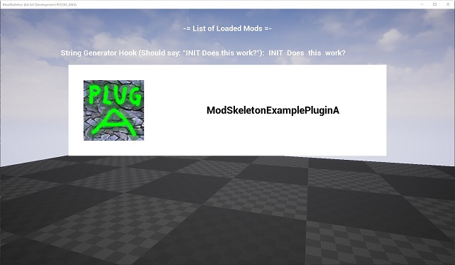

# ModSkeleton

- UE 4.20 Preview 4対応

```
Copyright 2017 Smogworks

Licensed under the Apache License, Version 2.0 (the "License");
you may not use this file except in compliance with the License.
You may obtain a copy of the License at

http://www.apache.org/licenses/LICENSE-2.0

Unless required by applicable law or agreed to in writing, software
distributed under the License is distributed on an "AS IS" BASIS,
WITHOUT WARRANTIES OR CONDITIONS OF ANY KIND, either express or implied.
See the License for the specific language governing permissions and
limitations under the License.
```

## 目標

- Unreal Engine 4のMODサポートのためのわかりやすいサンプルとなること
- エンジンの改変を必要としないこと - Epic Gamesランチャーからインストールされるコンパイル済みのUE4エディタで動作すること

## 使い方 (マニュアル操作の場合)

1. リポジトリをクローンする
1. ModSkeleton.uprojectを開く
1. コンテンツブラウザの"表示オプション" -> "プラグインコンテンツを表示"を選択し、サンプルプラグインのコンテンツが見えるようにする
1. こちらの手順に従い、カスタムプロファイルの設定を行う [Instruction to Build Custom Launcher Profiles](doc/build_profiles/build_profiles.md)
1. ModSkeletonExamplePluginAプラグインを無効にする。無効にしないとプラグインコンテンツが実行ファイルに含まれてしまうので注意 (編集 -> Plugins -> "ModSkeleton" セクション)
1. Full Game launchプロファイルを所望のプラットフォーム向けに実行する
1. ModSkeletonExamplePluginAプラグインを有効にする
1. Mod launchプロファイルを所望のプラットフォーム向けに実行する。この処理は途中で失敗するが、必要なPakファイルは生成されているため問題ない
1. Plugins/ModSkeletonExamplePluginA/Saved/StagedBuilds/[プラットフォーム名]/ModSkeleton/Plugins/ModSkeletonExamplePluginA/Content/Paks/[プラットフォーム名]/ModSkeletonExamplePluginA.pakをSaved/StagedBuilds/[プラットフォーム名]/ModSkeleton/Mods/ にコピーする (もしWin64とWindowsNoEditor向けにビルドしているのであれば、CopyExeAndPak.batを実行するだけでもよい)
1. Saved/StagedBuilds/[プラットフォーム名]/[ModSkeleton実行ファイル]を実行する。このアプリケーションは自動的にPakファイル(MOD)の読み込みを行う
1. ゲーム内コンソールから"open ExamplePluginA"を実行し、新しいマップが読み込まれることを確認する

もしMODが正しくロードされていれば、ゲーム画面は以下のようなものになる


## MODプラグインの開発

### コンテンツのみを開発する

1. UE4エディタでModSkeletonExamplePluginAプラグインを有効にする
1. 通常のUE4プロジェクトと同様に開発を行う
1. 開発が終わったらMod launchプロファイルを実行してPakファイル(MOD)を生成する

Note: これはMODのコンテンツを開発する最も簡単な方法ですが、MODロード時の挙動を確認することはできません (例えば、PakファイルがロードされたときのMOD管理メニューの動作確認など)

### デバッグ中にPakファイルをロードする

1. 所定の位置にMOD Pakファイルを設置する
1. DebugあるいはDebugGameビルドをVisual Studioから行う
1. Binaries/[アーキテクチャ名]/以下の全ファイルをSaved/StagedBuilds/[プラットフォーム名]/ModSkeleton/Binaries/[アーキテクチャ名]/にコピーする
1. Saved/StagedBuilds/[プラットフォーム名]/ModSkeleton/Binaries/[アーキテクチャ名]/のDebugあるいはDebugGameビルドの実行ファイルを実行する
1. Visual Studioデバッガを実行中のプロセスにアタッチする

注: ここまでのところ、Visual Studioから直接起動したDebugビルドからPakファイルを読み込み、アセットを使えることが確認できていません

## このサンプルの仕組み

### 起動時の挙動

- ModSkeletonGameInstanceが初期化され、ModSkeletonRegistryの唯一のインスタンスを初期化し、その参照を保持します
- ModSkeletonRegistryはModsディレクトリをスキャンし、適切なPak (".pak") ファイルを探し、すべてをロードします。また、Pakファイル内にあるAssetRegistry.binを読み込み、Pakファイル内のアセットをアセットレジストリに追加します。
- ModSkeletonRegistryはメモリ上にロードされたアセットレジストリ内を全検索し、"MOD_SKELETON"でクラス名が始まり、かつModSkeletonPluginInterfaceクラスを実装したクラスを見つけます
- そのクラスのプラグインインタフェースは、"ModSkeletonInit"がMODを登録する際、MODに接続する際、あるいはMODフックを実行する際に呼び出されます。

### ModSkeletonフック

- BPVariantはuobjectを親としたブループリントで使用可能なvariantクラスで、フックの呼び出しを介したデータの交換を簡単にします
- ”常に呼び出す"とマークされたフック(例えば"ModSkeletonInit"フックのようなものです)は、MOD_SKELETON初期化インタフェースがロードされる際に一度呼び出されます
- "常に呼び出す"とマークされていないフックは、それらが接続されたときだけ呼び出されます。また、その呼出は優先度順になります。
- フックはBPVariantsの配列への参照を引数として渡され、この"HookIO"は入出力双方のために使うことができます。フックによってアプリケーションの挙動を変えることができます

メインメニューの項目を要求するフックが登録されていると考えてください。元のゲームは"ニューゲーム", "ロードゲーム", "終了"というボタンを持つリストを返すとします。MOD作成者はこのリストを"ニューゲーム"ボタンを何か別のキャラクター作成画面へと続くテキストに置き換えることができます。仮想コードは以下のようなものになります。

```
class CoreGame implements ModSkeletonPluginInterface
  function ModSkeletonHook(String HookName, BPVariantArray HookIO)
    if HookName == "PopulateMainMenu"
      HookIO[0].Add( NewGameButton )
      HookIO[0].Add( LoadGameButton )
      HookIO[0].Add( ExitButton )
    end if
  end function
end class

class MyNewCharacterMod implements ModSkeletonPluginInterface
  function ModSkeletonHook(String HookName, BPVariantArray HookIO)
    if HookName == "PopulateMainMenu"
      HookIO[0].RemoveItem( NewGameButton )
      HookIO[0].Prepend( MyBetterNewGameButton )
    end if
  end function
end class
```

## TODO

- C++プラグインのサンプルを作成する
- DebugあるいはDebugGameビルドをVisual Studioから起動し、Pakファイルを読み込んで使う方法を見つける

## 疑問点

- 何かもっとよい配布方法はないか？　コア実装をプラグイン化できるかもしれないが、そうなると他のプラグインがプラグイン内のヘッダファイルに依存してしまうことになる。
- BPVariantブループリントコンストラクタヘルパーは若干できが悪い　(特に隠れたworld context -> outer pinsの部分) なにかもっといい形にする方法はないか？
- HookIO TArray< BPVariant* > in-outピンは思っていたよりも多くのコピーを発生させてしまう... 何かうまく解決する方法はないか？　参照として入力された値を変更したいだけなのに、出力ノードにも表示されてしまう
